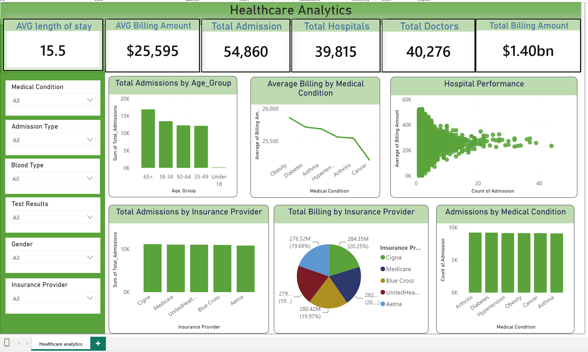

# Healthcare_Data_Engineering_and_Analytics_Pipeline

##  Project Overview

This project implements an end-to-end healthcare data pipeline, starting from raw data extraction and exploration, followed by data quality checks, cleaning, transformation, and loading into SQL Server.

SQL Server is then used for analytical queries and business-focused views, with Power BI connected to SQL Server to build an interactive healthcare analytics dashboard.

The project demonstrates practical skills across Data Engineering, SQL Analytics, and Business Intelligence.

---

##  Data Pipeline Architecture

---

##  Technologies Used

- Python
- Pandas
- SQLAlchemy
- PyODBC
- SQL Server
- SQL
- Power BI

---

##  ETL Process

### 1. Extract

The healthcare dataset was loaded into Python using Pandas for initial exploration and processing.

### 2. Explore & Validate

The dataset was analyzed for:

- Missing values
- Duplicate records
- Invalid dates
- Invalid values
- Outliers
- Data type consistency
- Negative billing amounts

### 3. Transform

Data transformations included:

- Converting date columns to datetime
- Calculating Length of Stay
- Standardizing text fields
- Formatting names
- Handling invalid records
- Removing invalid negative billing amounts
- Creating analytical fields such as Age Groups

### 4. Load

The cleaned dataset was loaded into SQL Server using SQLAlchemy and PyODBC.

---

##  SQL Analysis

SQL Server was used to perform business-oriented analysis and create analytical views.

Examples of business questions:

- Which medical conditions have the highest healthcare costs?
- Which hospitals have the highest admission volume?
- Which hospitals combine high admission volume with high average billing?
- Does admission type affect cost and length of stay?
- Which insurance providers have higher average billing?
- Which medical conditions are associated with longer hospital stays?
- Which age groups have higher healthcare costs?

---

##  Power BI Dashboard

The Power BI dashboard provides an interactive overview of:

- Total Admissions
- Total Billing
- Average Billing
- Average Length of Stay
- Hospital Performance
- Medical Condition Analysis
- Admission Type Analysis
- Insurance Provider Analysis

Users can filter the dashboard by:

- Medical Condition
- Admission Type
- Insurance Provider
- Gender
- Age Group

### Dashboard Preview

---

##  Key Analytical Areas

### Hospital Performance

Hospital performance is evaluated using:

- Total Admissions
- Total Billing
- Average Billing
- Average Length of Stay

A scatter plot is used to identify hospitals with high admission volume and high average billing.

### Healthcare Costs

Billing patterns are analyzed across:

- Medical Conditions
- Hospitals
- Insurance Providers
- Admission Types
- Age Groups

### Length of Stay

Average length of stay is analyzed across medical conditions and admission types to identify patterns associated with longer hospital stays.

